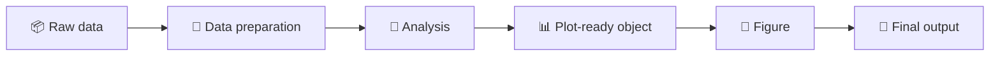
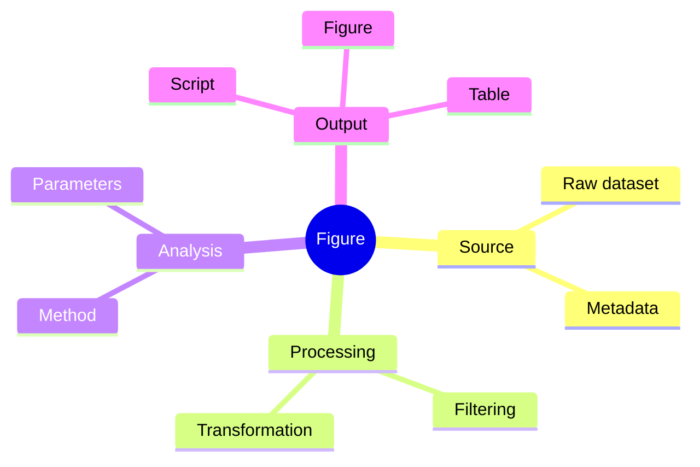
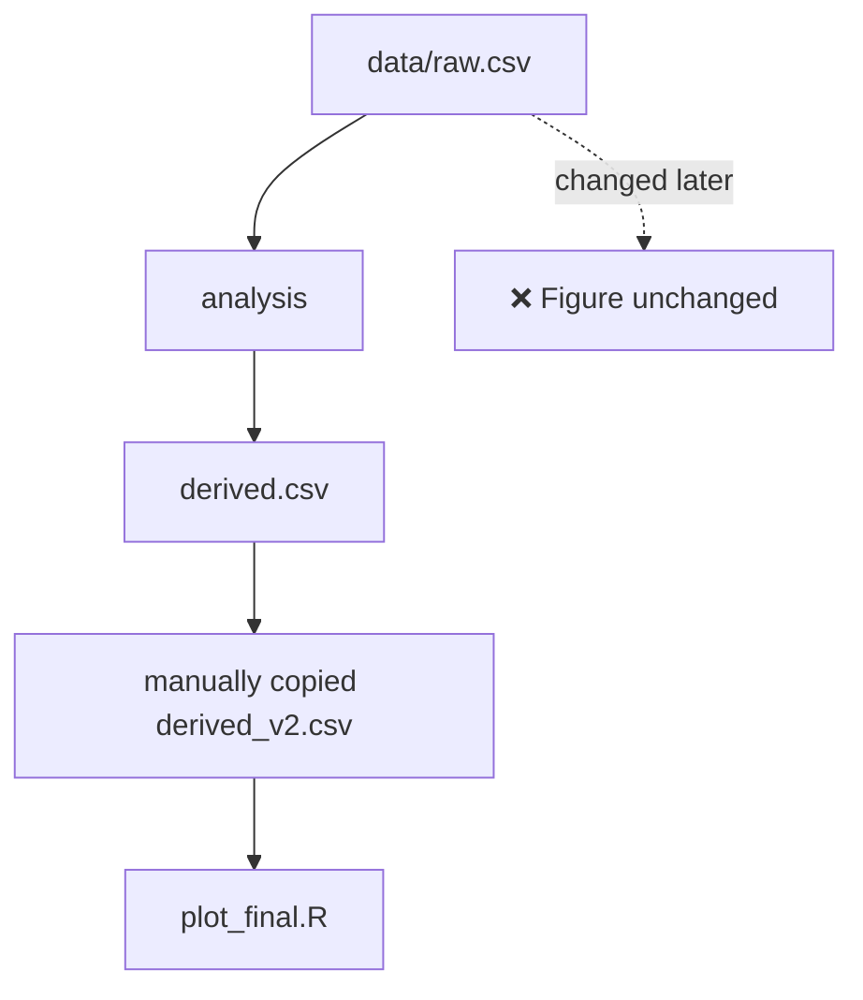
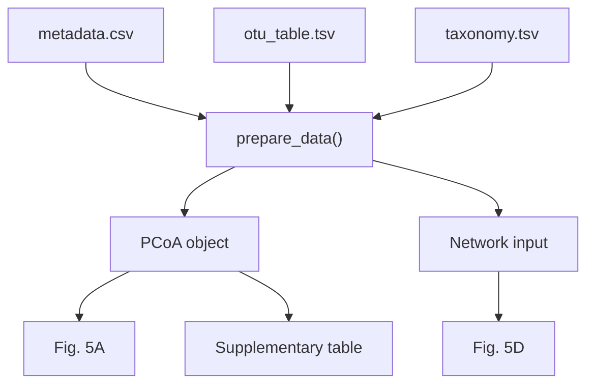

<p align="center">
  
</p>

<div align="center">

# 🌿 r-data-lineage-plotting

**Every figure should know where it came from.**

[](#)
[](#)
[](#)

**English** · [简体中文](./README.zh-CN.md)

</div>

---

## 📊 A figure is never just a figure

A final panel may look simple:

```text
Figure 5D
```

but behind it may be:

```text
OTU / ASV table
→ filtering
→ transformation
→ model / statistics
→ intermediate object
→ plotting
→ final figure
```

When these steps are disconnected, reproducibility disappears.

`r-data-lineage-plotting` keeps the lineage explicit.

## 🌱 The central idea



Every arrow should be reproducible.

## 🔍 Every result should answer four questions



A researcher should be able to ask:

> Where did this figure come from?  
> Which script generated it?  
> Which transformations occurred?  
> If the source data change, will the figure change too?

## 🗂 Data directory philosophy

### `/data`

Stable source inputs, for example:

```text
raw sequencing data
OTU / ASV tables
taxonomy tables
metadata
upstream transcriptome tables
environmental measurements
```

### `/output`

Reproducible derived data:

```text
ordination objects
network tables
model outputs
intermediate statistics
```

### `/result`

Formal deliverables:

```text
figures
publication tables
supplementary tables
```

## 🚨 The problem this Skill tries to prevent



The figure still exists, but it may no longer represent the current source data.

## ✅ Preferred pattern

For a simple figure:

```text
01_plot_pcoa.R
     ↓
read_data
     ↓
prepare_data
     ↓
statistics
     ↓
plot
```

For computationally expensive analyses:

```text
prepare_network.R
       ↓
network object
       ↓
plot_network.R
```

Intermediate files should exist because the analysis requires them — not because every script automatically writes them.

## 🧬 Data lineage as a dependency graph



Change a source once. Recompute everything downstream.

## 🧠 AI behavior encouraged by this Skill

Before writing a plotting script, AI should ask:

```text
What are the true source data?
        ↓
What must be calculated?
        ↓
Which intermediates are worth preserving?
        ↓
Which outputs are formal deliverables?
        ↓
How should dependencies be encoded?
```

Not:

```text
Which CSV is most convenient to read right now?
```

## 🔬 Designed for scientific workflows

Especially useful for:

- ecology
- microbial ecology and microbiome analysis
- soil and environmental science
- transcriptomics
- metabolomics
- multi-omics
- publication figures
- complex multi-panel figures

## 🌿 Philosophy

> **A publication figure should be the end of a reproducible data lineage — not the end of a chain of copied files.**
