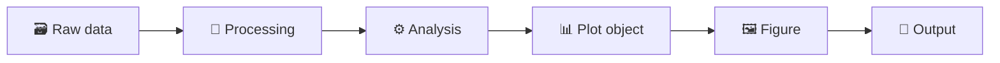
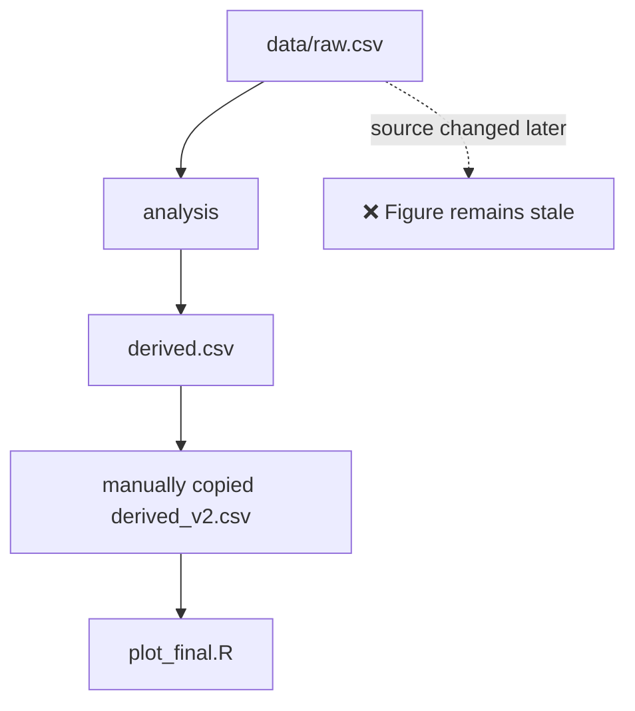
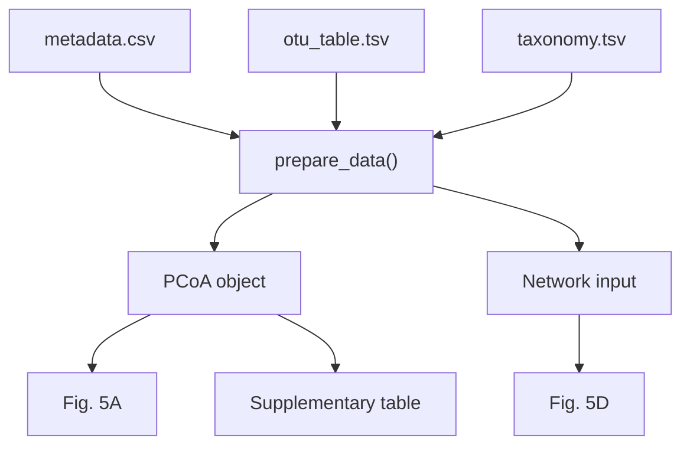

<p align="center">
  
</p>

<div align="center">

[](#)
[](#)
[](#)
[](#)
[](#)

**English** · [简体中文](./README.zh-CN.md)

</div>

---

## 📌 Overview

A scientific figure is never just a figure. Behind one panel may be a long dependency chain of source tables, filtering rules, transformations, models and intermediate objects.

`r-data-lineage-plotting` helps AI build R workflows where every result remains connected to its true source:

> **raw data → processing → analysis → plot object → figure → formal output**

The goal is to make figure generation **traceable, reproducible and resistant to stale intermediate files**.

## 📦 Installation

### Recommended: manage Skills with CC Switch

For a multi-agent environment, use **CC Switch as the unified Skill manager** instead of maintaining separate physical copies for Claude Code, Codex, or other agents.

Import this Skill into CC Switch:

**Windows PowerShell**

```powershell
Start-Process "ccswitch://v1/import?resource=skill&name=r-data-lineage-plotting&repo=apexpeng/r-data-lineage-plotting&branch=main"
```

**macOS**

```bash
open "ccswitch://v1/import?resource=skill&name=r-data-lineage-plotting&repo=apexpeng/r-data-lineage-plotting&branch=main"
```

Direct URI:

```text
ccswitch://v1/import?resource=skill&name=r-data-lineage-plotting&repo=apexpeng/r-data-lineage-plotting&branch=main
```

After import, open **CC Switch → Skills** and install/sync the Skill to the agents you want to use. **CC Switch built-in storage + SymbolicLink sync** is recommended for a shared local Skill library.

### Recommended installation order for this Skill suite

```text
1. skill-install-workflow
        ↓
2. r-data-lineage-plotting   ← this Skill
        ↓
3. write-human-r-code
```

1. Install **`skill-install-workflow` first** so subsequent Skills are governed by duplicate, version, provenance and validation checks.
2. Install **`r-data-lineage-plotting` second** to establish authoritative-input, directory-role and data-lineage rules for scientific R projects.
3. Install **`write-human-r-code` third** to add human-readable coding and refactoring guidance. The two R Skills are complementary: lineage governs data flow; human-code governs script structure and readability.

## 🌱 Data lineage pipeline



Every arrow should be reproducible.

## ✅ Key features

| Feature | Purpose |
|---|---|
| 🌿 **Explicit data lineage** | Every figure can be traced back to true source inputs |
| 🔗 **Dependency-aware workflow** | Upstream changes propagate through downstream analysis |
| 🧪 **Right-sized intermediates** | Save intermediate objects only when computationally justified |
| 📊 **Modular plotting scripts** | Keep input, preparation, analysis, plotting and export visible |
| 🧾 **Reproducible outputs** | Formal figures and tables are regenerated, not manually copied |

## 🗂 Directory philosophy

| Directory | Role | Typical content |
|---|---|---|
| `/data` | Stable source inputs | raw sequencing data, OTU/ASV tables, taxonomy, metadata, upstream omics tables |
| `/output` | Reproducible derived objects | ordinations, network objects, model outputs, intermediate statistics |
| `/result` | Formal deliverables | publication figures, final tables, supplementary tables |

The key rule is simple:

> **Derived data should not quietly become a new source of truth.**

## 🚨 The failure mode this Skill tries to prevent



The figure still exists — but it may no longer represent the current source data.

## ✅ Preferred pattern

For a simple figure:

```text
01_plot_pcoa.R
     ↓
read_data
     ↓
prepare_data
     ↓
statistics
     ↓
plot
     ↓
save
```

For a genuinely expensive workflow:

```text
prepare_network.R
       ↓
network object
       ↓
plot_network.R
```

The distinction is intentional: intermediate files exist because the analysis needs them, not because every script automatically writes them.

## 🧬 Dependency graph thinking



Change a source once. Recompute everything downstream.

## 🧠 What AI should ask before plotting

```text
What are the true source data?
        ↓
What must be calculated?
        ↓
Which intermediate objects are worth preserving?
        ↓
Which outputs are formal deliverables?
        ↓
How should dependencies be encoded?
```

Not:

```text
Which CSV is most convenient to read right now?
```

## 🎯 Suitable for

- ecology and microbial ecology
- microbiome analysis
- soil and environmental science
- transcriptomics and metabolomics
- multi-omics workflows
- publication-quality figures
- complex multi-panel scientific figures

---

> **A publication figure should be the end of a reproducible data lineage — not the end of a chain of copied files.**
