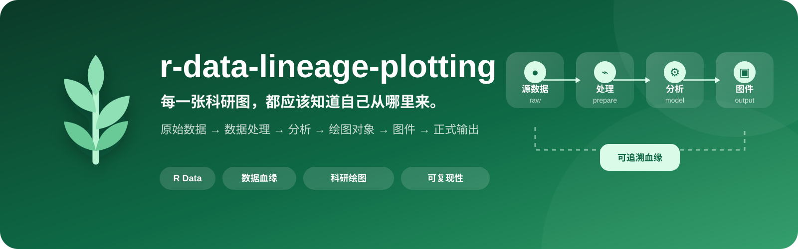
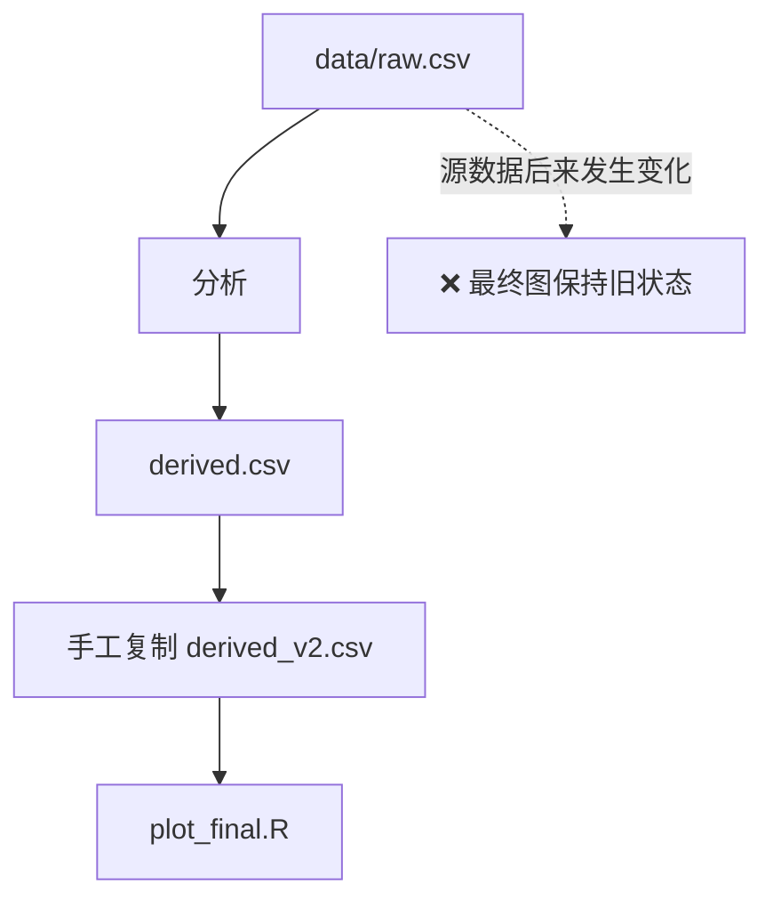
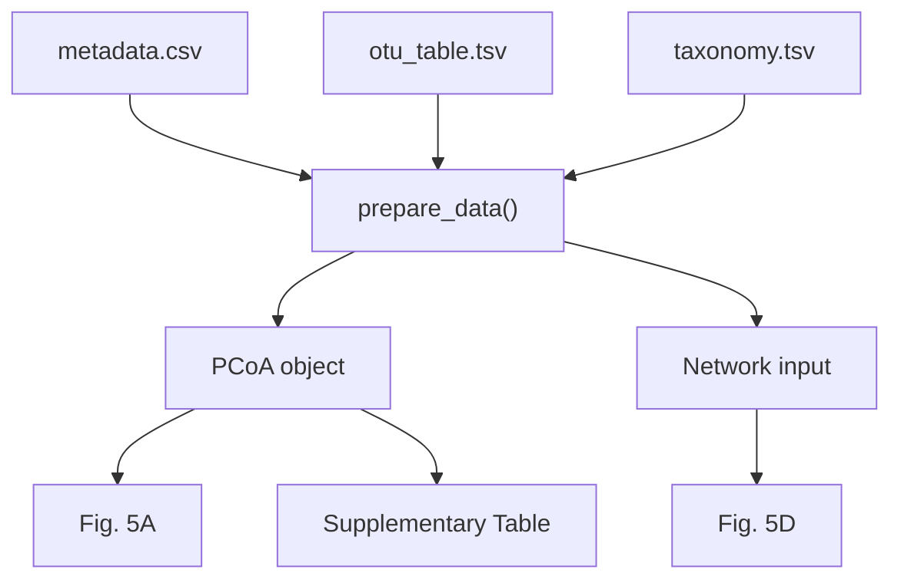

<p align="center">
  
</p>

<div align="center">

[](#)
[](#)
[](#)
[](#)
[](#)

[English](./README.md) · **简体中文**

</div>

---

## 📌 概述

一张科研图从来不只是一张图。一个 panel 背后往往连接着源数据、筛选规则、数据转换、统计模型和多个中间分析对象。

`r-data-lineage-plotting` 希望 AI 构建的 R 工作流始终保持真实来源关系：

> **原始数据 → 数据处理 → 分析 → 绘图对象 → 图件 → 正式输出**

目标是让科研绘图**可追溯、可复现，并避免被过期的中间文件悄悄污染**。

## 📦 安装

### 推荐：使用 CC Switch 统一管理 Skill

如果同时使用 Claude Code、Codex、DeepSeek Harness 等多个 Agent，推荐由 **CC Switch 统一管理 Skill**，避免在多个 Agent 目录维护重复实体副本。

使用 CC Switch 官方 Deep Link 导入本 Skill：

**Windows PowerShell**

```powershell
Start-Process "ccswitch://v1/import?resource=skill&name=r-data-lineage-plotting&repo=apexpeng/r-data-lineage-plotting&branch=main"
```

**macOS**

```bash
open "ccswitch://v1/import?resource=skill&name=r-data-lineage-plotting&repo=apexpeng/r-data-lineage-plotting&branch=main"
```

也可以直接打开：

```text
ccswitch://v1/import?resource=skill&name=r-data-lineage-plotting&repo=apexpeng/r-data-lineage-plotting&branch=main
```

导入后，在 **CC Switch → Skills** 中选择需要使用该 Skill 的 Agent 并完成安装/同步。多 Agent 环境推荐采用 **CC Switch 内置存储 + SymbolicLink（软链接）同步**。

### 三个 Skill 的推荐安装顺序

```text
1. skill-install-workflow
        ↓
2. r-data-lineage-plotting   ← 当前 Skill
        ↓
3. write-human-r-code
```

推荐理由：

1. **先安装 `skill-install-workflow`**：让后续 Skill 安装先经过来源、重复、版本、风险和完整性治理。
2. **再安装 `r-data-lineage-plotting`**：先建立科研 R 项目的权威输入、目录职责与数据血缘基础。
3. **最后安装 `write-human-r-code`**：进一步约束 R 脚本的可读性、结构与重构方式。两个 R Skill 是互补关系：前者管数据流，后者管代码结构与可维护性。

## 🌱 数据血缘流水线


每一个箭头都应该可以重新执行。

## ✅ 核心特性

| 特性 | 作用 |
|---|---|
| 🌿 **显式数据血缘** | 每个图都能追溯回真正的源输入 |
| 🔗 **依赖感知工作流** | 上游数据变化能够传递到下游结果 |
| 🧪 **合理保存中间对象** | 只有在计算成本或复用需求成立时才保存 |
| 📊 **模块化绘图脚本** | 输入、整理、分析、绘图、输出保持清晰 |
| 🧾 **正式结果可复现** | 图和表由流程重新生成，而不是手工复制 |

## 🗂 目录理念

| 目录 | 定位 | 典型内容 |
|---|---|---|
| `/data` | 稳定的源输入 | 原始测序数据、OTU/ASV、taxonomy、metadata、上游组学表 |
| `/output` | 可重新生成的派生对象 | PCoA、网络对象、模型结果、中间统计表 |
| `/result` | 正式交付结果 | 论文图件、正式结果表、Supplementary tables |

核心规则很简单：

> **二次计算数据不能悄悄变成新的事实源。**

## 🚨 最希望避免的错误模式



图还在，但它可能已经不再代表当前的数据。

## ✅ 推荐模式

对于简单图：

```text
01_plot_pcoa.R
     ↓
read_data
     ↓
data_prepare
     ↓
statistics
     ↓
plot
     ↓
save
```

对于真正计算复杂的流程：

```text
prepare_network.R
       ↓
network object
       ↓
plot_network.R
```

这里存在 `prepare`，是因为分析确实复杂，而不是因为所有绘图都必须机械拆成 `prepare + plot`。

## 🧬 用依赖图理解数据血缘



修改一处源数据，重新运行，下游结果应随之更新。

## 🧠 AI 在绘图前应该先问

```text
真正的源数据是什么？
        ↓
哪些数据需要现场计算？
        ↓
哪些中间对象值得保存？
        ↓
哪些属于正式输出？
        ↓
依赖关系应该怎样编码？
```

而不是：

```text
现在手边哪个 CSV 最方便读取？
```

## 🎯 适用场景

- 生态学与微生物生态学
- 微生物组分析
- 土壤与环境科学
- 转录组与代谢组
- 多组学工作流
- 论文级科研绘图
- 多 panel 复杂图件

---

> **论文图件应该是可复现数据血缘的终点，而不是一串手工复制文件的终点。**
