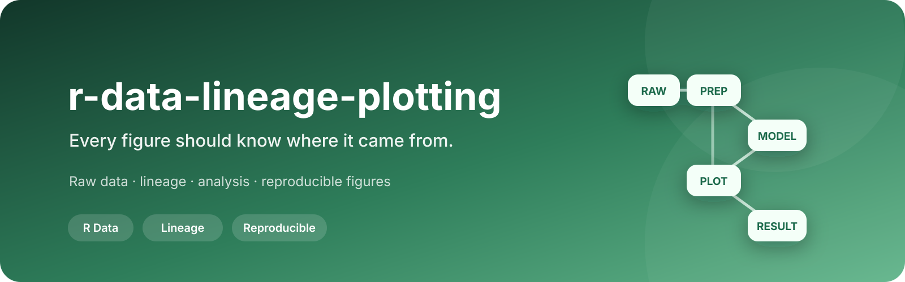
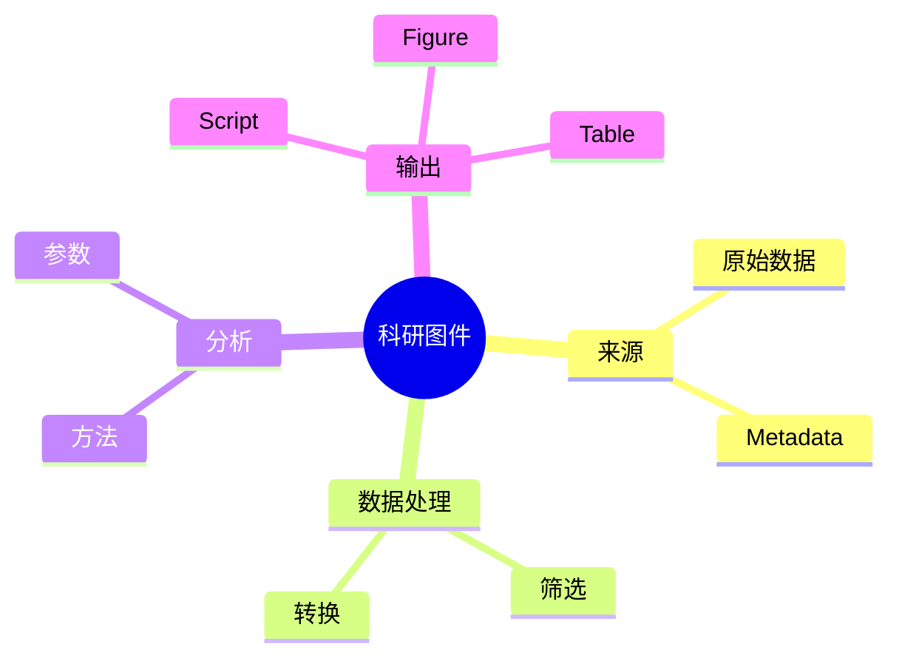
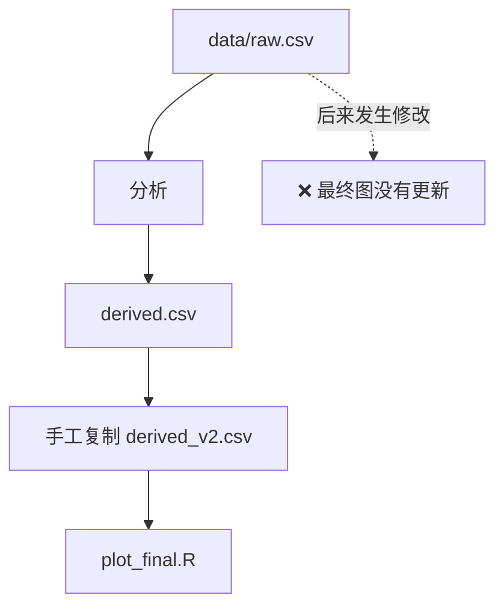
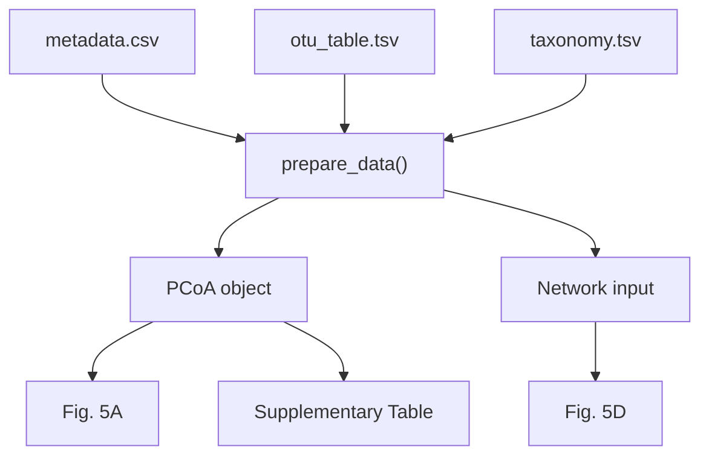

<p align="center">
  
</p>

<div align="center">

# 🌿 r-data-lineage-plotting

**每一张科研图，都应该知道自己从哪里来。**

[](#)
[](#)
[](#)

[English](./README.md) · **简体中文**

</div>

---

## 📊 一张图，从来不只是一张图

最终论文里可能只是：

```text
Fig. 5D
```

但它背后可能经历：

```text
OTU / ASV 表
↓
筛选
↓
数据转换
↓
统计 / 模型
↓
中间分析对象
↓
绘图
↓
最终图件
```

只要其中任何一步与源数据脱节，最终图件就失去了真正的可复现性。

`r-data-lineage-plotting` 就是为了让这条血缘始终清晰。

## 🌱 核心思想


每一个箭头都应该可以重新执行。

## 🔍 每个结果都应该回答 4 个问题



也就是说：

> 这个图的数据来自哪里？  
> 哪个脚本生成？  
> 中间进行了哪些处理？  
> 原始数据变化后，图会不会同步变化？

## 🗂 数据目录原则

### `/data`

只保存稳定、不可再生的源输入，例如：

```text
原始测序文件
OTU / ASV table
taxonomy
metadata
转录组上游结果
环境因子
```

### `/output`

保存由源数据计算得到、可重新生成的分析产物，例如：

```text
PCoA objects
网络分析中间结果
模型结果
统计表
```

### `/result`

保存正式交付结果，例如：

```text
论文图件
正式结果表
Supplementary tables
```

## 🚨 最希望避免的情况



这意味着图还在，但它已经不再对应当前源数据。

## ✅ 简单图应该这样

```text
01_plot_pcoa.R
     ↓
read_data
     ↓
data_prepare
     ↓
statistics
     ↓
plot
```

而不是默认：

```text
01_prepare_data.R
↓
很多 CSV
↓
不知道谁在读取
↓
最终图
```

## 🧪 复杂计算可以合理拆分

网络、iCAMP 等计算成本较高的任务，可以：

```text
prepare_network.R
       ↓
network object
       ↓
plot_network.R
```

这里存在 `prepare` 是因为计算本身复杂，而不是因为所有分析都必须强行拆成 `prepare + plot`。

## 🧬 数据血缘就是依赖图



理想状态是：

```text
修改一处源数据
↓
重新运行
↓
所有下游结果同步变化
```

## 🧠 这个 Skill 希望 AI 在绘图之前先想

```text
真正的源数据是什么？
        ↓
哪些数据必须现场计算？
        ↓
哪些中间结果值得保存？
        ↓
哪些属于正式输出？
        ↓
怎样保证依赖关系可追踪？
```

而不是：

```text
现在手边哪个 CSV 最方便读取？
```

## 🔬 适用研究

尤其适用于：

- 生态学
- 微生物生态学 / 微生物组
- 土壤与环境科学
- 转录组
- 代谢组
- 多组学
- 论文绘图
- 多 panel 复杂科研图件

## 🌿 核心理念

> **论文图件应该是可复现数据血缘的终点，而不是一串手工复制文件的终点。**
