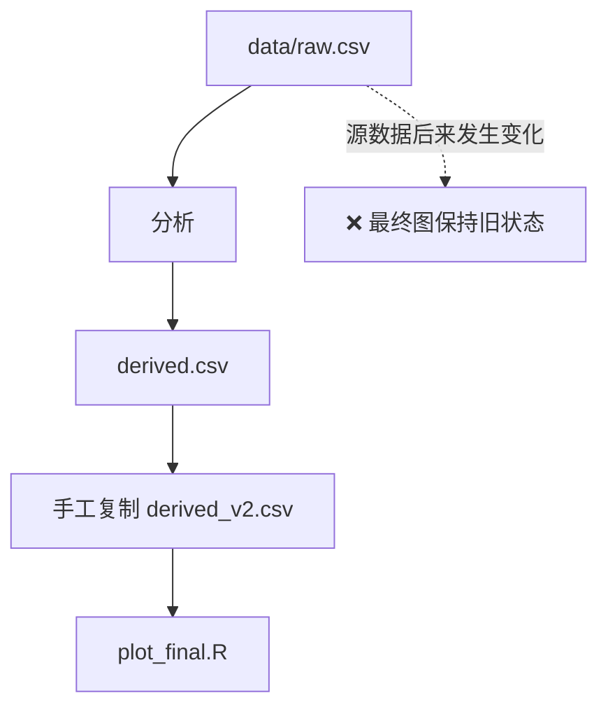
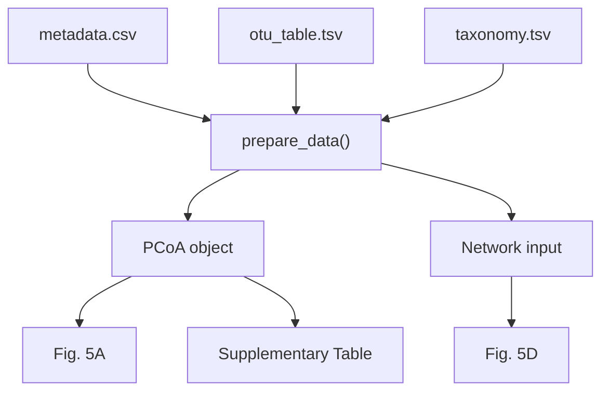

<p align="center">
  
</p>

<div align="center">

[](#)
[](#)
[](#)
[](#)
[](#)

[English](./README.md) · **简体中文**

</div>

---

## 📌 概述

一张科研图从来不只是一张图。一个 panel 背后往往连接着源数据、筛选规则、数据转换、统计模型和多个中间分析对象。

`r-data-lineage-plotting` 希望 AI 构建的 R 工作流始终保持真实来源关系：

> **原始数据 → 数据处理 → 分析 → 绘图对象 → 图件 → 正式输出**

目标是让科研绘图**可追溯、可复现，并避免被过期的中间文件悄悄污染**。

## 🌱 数据血缘流水线


每一个箭头都应该可以重新执行。

## ✅ 核心特性

| 特性 | 作用 |
|---|---|
| 🌿 **显式数据血缘** | 每个图都能追溯回真正的源输入 |
| 🔗 **依赖感知工作流** | 上游数据变化能够传递到下游结果 |
| 🧪 **合理保存中间对象** | 只有在计算成本或复用需求成立时才保存 |
| 📊 **模块化绘图脚本** | 输入、整理、分析、绘图、输出保持清晰 |
| 🧾 **正式结果可复现** | 图和表由流程重新生成，而不是手工复制 |

## 🗂 目录理念

| 目录 | 定位 | 典型内容 |
|---|---|---|
| `/data` | 稳定的源输入 | 原始测序数据、OTU/ASV、taxonomy、metadata、上游组学表 |
| `/output` | 可重新生成的派生对象 | PCoA、网络对象、模型结果、中间统计表 |
| `/result` | 正式交付结果 | 论文图件、正式结果表、Supplementary tables |

核心规则很简单：

> **二次计算数据不能悄悄变成新的事实源。**

## 📦 安装

本仓库是一个独立 AI Agent Skill，**不要求使用 CC Switch**。

### Claude Code

**macOS / Linux**

```bash
mkdir -p ~/.claude/skills
git clone https://github.com/apexpeng/r-data-lineage-plotting.git \
  ~/.claude/skills/r-data-lineage-plotting
```

**Windows PowerShell**

```powershell
$target = Join-Path $HOME ".claude/skills/r-data-lineage-plotting"
New-Item -ItemType Directory -Force (Split-Path $target -Parent) | Out-Null
git clone https://github.com/apexpeng/r-data-lineage-plotting.git $target
```

### OpenAI Codex

**macOS / Linux**

```bash
mkdir -p ~/.codex/skills
git clone https://github.com/apexpeng/r-data-lineage-plotting.git \
  ~/.codex/skills/r-data-lineage-plotting
```

**Windows PowerShell**

```powershell
$target = Join-Path $HOME ".codex/skills/r-data-lineage-plotting"
New-Item -ItemType Directory -Force (Split-Path $target -Parent) | Out-Null
git clone https://github.com/apexpeng/r-data-lineage-plotting.git $target
```

### DeepSeek Harness / shared Agent Skill 目录

**macOS / Linux**

```bash
mkdir -p ~/.agents/skills
git clone https://github.com/apexpeng/r-data-lineage-plotting.git \
  ~/.agents/skills/r-data-lineage-plotting
```

**Windows PowerShell**

```powershell
$target = Join-Path $HOME ".agents/skills/r-data-lineage-plotting"
New-Item -ItemType Directory -Force (Split-Path $target -Parent) | Out-Null
git clone https://github.com/apexpeng/r-data-lineage-plotting.git $target
```

> 如果你的 Agent 使用自定义 Skill 目录，请安装到实际配置的位置。

### 如果已经安装 `skill-install-workflow`

可以直接对 Agent 说：

```text
安装这个 Skill：
https://github.com/apexpeng/r-data-lineage-plotting.git
```

由治理 Skill 在安装前检查来源、重复、版本冲突和风险，并在安装后验证完整性。

### 可选：CC Switch

如果你本身已经使用 CC Switch 管理多个 Agent 的 Skill，可以通过 CC Switch 导入本仓库，避免维护多份实体副本。CC Switch 的推荐架构、SymbolicLink 管理方式和三个 Skill 的推荐安装顺序，请参见 [`skill-install-workflow`](https://github.com/apexpeng/skill-install-workflow) 的 README。

## 🚨 最希望避免的错误模式



图还在，但它可能已经不再代表当前的数据。

## ✅ 推荐模式

对于简单图：

```text
01_plot_pcoa.R
     ↓
read_data
     ↓
data_prepare
     ↓
statistics
     ↓
plot
     ↓
save
```

对于真正计算复杂的流程：

```text
prepare_network.R
       ↓
network object
       ↓
plot_network.R
```

这里存在 `prepare`，是因为分析确实复杂，而不是因为所有绘图都必须机械拆成 `prepare + plot`。

## 🧬 用依赖图理解数据血缘



修改一处源数据，重新运行，下游结果应随之更新。

## 🧠 AI 在绘图前应该先问

```text
真正的源数据是什么？
        ↓
哪些数据需要现场计算？
        ↓
哪些中间对象值得保存？
        ↓
哪些属于正式输出？
        ↓
依赖关系应该怎样编码？
```

而不是：

```text
现在手边哪个 CSV 最方便读取？
```

## 🎯 适用场景

- 生态学与微生物生态学
- 微生物组分析
- 土壤与环境科学
- 转录组与代谢组
- 多组学工作流
- 论文级科研绘图
- 多 panel 复杂图件

---

> **论文图件应该是可复现数据血缘的终点，而不是一串手工复制文件的终点。**
